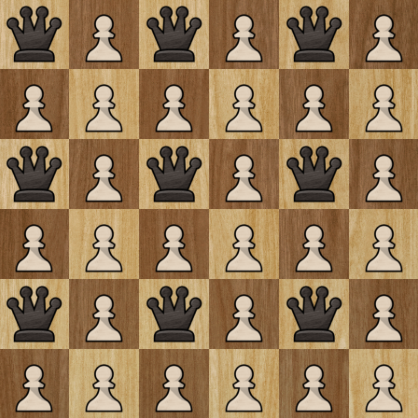

# Entrada
O número $m$ de rainhas e o número $n$ de linhas do tabuleiro.

# Saída

Número mínimo de peões para colocar as rainhas no tabuleiro, e um exemplo.

# Algorítmo

Será utilizada uma matriz de caracteres para representar as casas do tabuleiro. No início, a matriz estará vazia. Conforme for sendo percorrida, serão adicionados caracteres para representar uma escolha em cada casa:

'$r$' para representar uma rainha, '$.$' para representar um espaço vazio e '$p$' para representar um peão.

Para saber qual o mínimo possível de peões utilizados, testaremos cada caso, desde um número pequeno de peões até o número máximo, de forma que seja possível garantir que todas as soluções possíveis pertençam a esse intervalo de peões.

Para cada número de peões, digamos $x$, percorreremos a matriz coluna a coluna. Devemos utilizar $x$ peões e $m$ rainhas no total.

Em cada casa que o programa passa, é escolhida alguma peça para colocar: '$r$', diminuindo $m$, '$p$' diminuindo $x$, ou '.', vazio. Se nenhuma condição for quebrada, continuamos o processo, caso contrário, trocamos a peça colocada, se nenhuma peça funcionar, voltamos pro caso anterior.

# Otimizações

Se existe um tabuleiro que funciona com $p$ peões e $r$ rainhas, tem um tabuleiro que funciona que tem alguma rainha na primeira metade da primeira coluna.

Assim, não precisamos checar um tabuleiro que não tem rainhas na primeira metade da primeira coluna.

Um número mínimo de peões em um tabuleiro $n \times y$ é $r-n$, pois, podemos olhar para cada coluna. Se uma linha tem $k$ rainhas, deve ter, pelo menos, $k-1$ peões.

$$p \geq \sum^{n}_{i=1} k_i -1 = \#rainhas - n = r-n $$

e, o número máximo de peões é todo o tabuleiro menos as rainhas.

$$x \leq n^2- \#rainhas = n \times y-m$$

Além disso, como não podem ter duas rainhas vizinhas, pois não conseguiríamos colocar um peão para proteger, o máximo de rainhas é em cada linha é $\lceil \frac{y}{2}\rceil$ e em cada coluna é $\lceil \frac{n}{2}\rceil$. Assim, o máximo de rainhas no tabuleiro $n \times y$ é

$$\bigg\lceil \dfrac{n}{2}\bigg\rceil \times \bigg\lceil \dfrac{y}{2}\bigg\rceil.$$

Ou seja, se

$$m > \bigg\lceil \dfrac{n}{2}\bigg\rceil \times \bigg\lceil \dfrac{y}{2}\bigg\rceil,$$

então, não há solução, mas sempre tem, caso contrário.

Exemplo máximo par:

Exemplo máximo ímpar:

Assim, com essas otimizações, conseguimos diminuir nossos casos de teste.